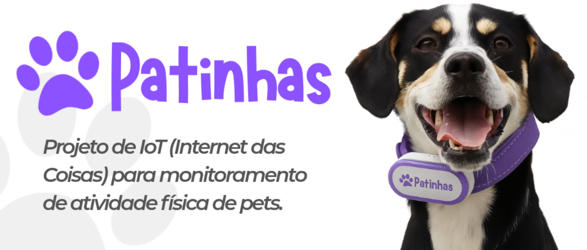
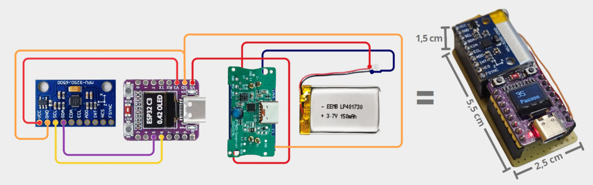
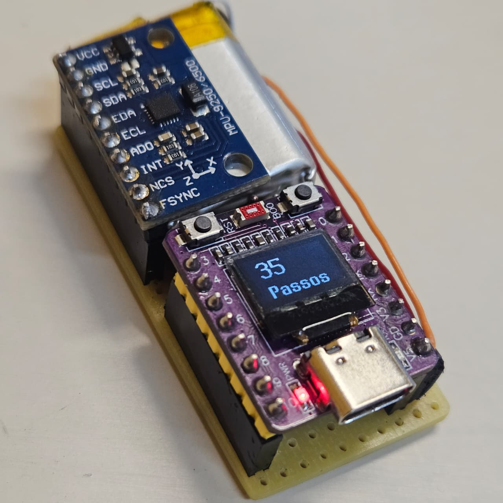
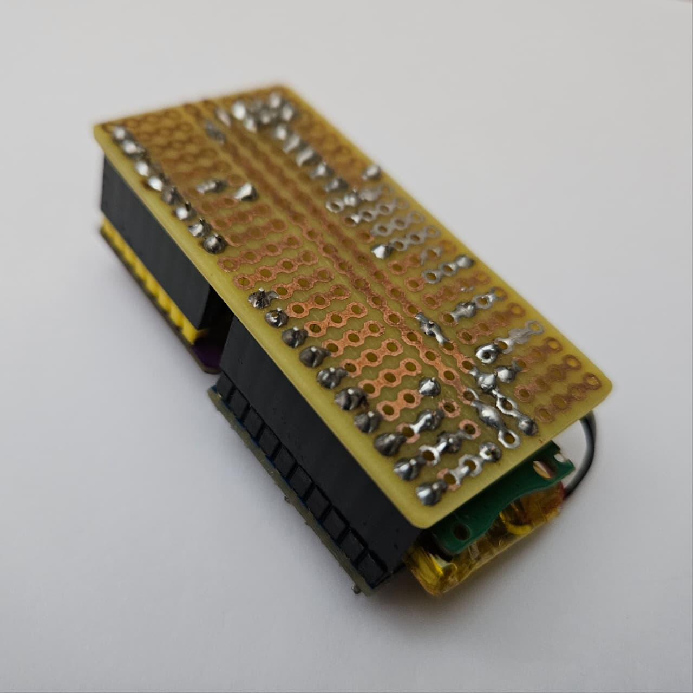
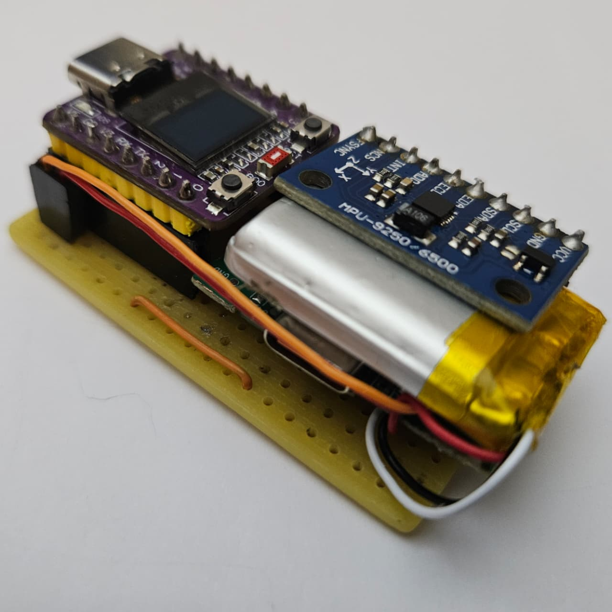

# Funcionamento Técnico do Dispositivo - Patinhas-CFA

  

Este documento detalha o funcionamento interno, a eletrônica, os algoritmos embarcados e os protocolos de comunicação do dispositivo IoT (coleira inteligente). Esta implementação é uma evolução direta do [Patinhas](https://github.com/willianjsf/Patinhas-CFA/tree/main), estendendo as funcionalidades de hardware e contagem de passos com modelos de Machine Learning para classificação comportamental na borda.

---

## 1. Arquitetura de Hardware

O dispositivo físico foi projetado com um design minimalista, focado em leveza e reaproveitamento de materiais. Ele é construído com base nos seguintes componentes e materiais reciclados:

| Componente | Especificação/Origem | Função no Sistema |
| --- | --- | --- |
| Microcontrolador | ESP32-C3 Super Mini | Processamento core, inferência em tempo real, comunicação TCP/UDP Wi-Fi. |
| Sensor Inercial | MPU9250 | Captura vetorial de Aceleração e Giroscópio via protocolo I2C. |
| Display Periférico | OLED SSD1306 0.42'' | Interface de debug do hardware, status de conexão AP/IP e contagem local. |
| Alimentação | Bateria Li-po 3.7V 300mAh | Fornecer autonomia de energia ao ESP32. (Reciclada). |
| Gerenciador de Carga | Módulo Li-po genérico | Proteção e recarregamento seguro da bateria via USB. (Reciclado). |
| Invólucro | Case plástica com velcro | Proteção do circuito, isolamento elétrico e acoplamento seguro na coleira. |
| Placa Base | Placa de circuito universal | Soldagem estrutural com pinos fêmea para troca de componentes. |

  
  

---

## 2. Inicialização e Conexão de Rede (Protocolos)

O dispositivo executa uma rotina de inicialização em camadas para garantir a conexão sem fios e a localização do servidor local sem a necessidade de definir credenciais estáticas no código.

### 2.1. Provisionamento de Wi-Fi (WiFiManager)
1. Ao ligar, o firmware lê a memória não-volátil (NVS) do ESP32 para buscar a última rede Wi-Fi salva.
2. Caso não encontre ou não consiga conectar, o dispositivo entra em modo Access Point (AP).
3. Uma rede Wi-Fi aberta chamada `Patinhas-Config` é criada.
4. O usuário conecta-se a essa rede, o que aciona o portal de provisionamento nativamente através do WebView do aplicativo mobile (ou via portal cativo padrão do navegador) para a inserção das credenciais do roteador local.
5. As credenciais são gravadas na memória flash e a placa reinicia automaticamente para se conectar à rede. A função de economia de energia (`WiFi.setSleep(false)`) é desativada para evitar latência.

### 2.2. Autodescoberta do Servidor (UDP Broadcast)
Após estabelecer a conexão Wi-Fi, o dispositivo localiza o IP do servidor Flask.
1. O ESP32 abre um socket UDP e envia pacotes em broadcast na porta `50000` com a mensagem `DISCOVER_SERVER`.
2. O servidor Python intercepta o pacote UDP e responde diretamente para o ESP32 confirmando seu endereço IP.
3. O dispositivo armazena esse IP em memória, encerra a busca e transmite seu próprio endereço IP local para o servidor iniciar a comunicação bidirecional.

---

## 3. Sistema Operacional de Tempo Real (FreeRTOS) e Processamento

Para otimizar o consumo de energia, isolar o hardware de instabilidades de rede e garantir a temporização rígida da amostragem, o firmware utiliza concorrência baseada em threads (Tasks) sobre o FreeRTOS.

### 3.1. Arquitetura Multitarefa
* **Task de Sensor (Prioridade Alta):** Executa a leitura inercial a 50Hz exatos, aplica a heurística de passos e armazena os dados em um sistema de Double Buffering para evitar colisão de memória.
* **Task de IA e Rede (Prioridade Baixa):** Processa as inferências do Random Forest na matriz secundária e executa requisições HTTP POST utilizando o tempo ocioso do processador.
* **Task de Display (Prioridade Média):** Atualiza a tela OLED gerenciando o acesso ao barramento I2C através de um Semáforo Mutex, prevenindo conflitos elétricos com o MPU9250.

### 3.2. Heurística do Contador de Passos
1. **Magnitude Escalar:** Calcula a aceleração resultante combinando os três eixos espaciais: $A = \sqrt{accX^2 + accY^2 + accZ^2}$.
2. **Filtragem de Ruído:** Passa a magnitude por um filtro de média móvel com profundidade de 3 amostras.
3. **Detecção de Picos e Vales:** Um passo é validado quando a aceleração filtrada ultrapassa o limiar superior de 1.2G e cruza abaixo do limiar inferior de 0.95G. É exigido um intervalo mínimo obrigatório de 100 milissegundos entre registros.
4. **Filtro Anti-Falso-Positivo:** Se a velocidade angular do giroscópio exceder 100 graus por segundo, o incremento entra em período de espera de 500 milissegundos para ignorar chacoalhões físicos do animal.

### 3.3. Classificação Comportamental (Random Forest)
1. **Janela Temporal:** O firmware agrupa 100 amostras consecutivas (2 segundos de movimento contínuo).
2. **Extração Estatística:** Calcula a Média Aritmética e o Desvio Padrão para os 6 eixos, gerando um vetor de 12 características.
3. **Inferência Local:** O vetor é submetido à árvore de decisão em C++ embarcada para classificar o comportamento ativo.

### 3.4. Monitoramento de Bateria
1. **Isolamento do Rádio:** A leitura analógica mapeia obrigatoriamente para o GPIO 2, pertencente ao conversor ADC1, visto que o conversor ADC2 é desativado fisicamente no ESP32-C3 quando o módulo Wi-Fi entra em operação.
2. **Mapeamento e Contenção:** O sinal bruto é convertido para uma métrica percentual utilizando limites empíricos. O código trava os resultados via condicionais de contenção para evitar envios numéricos corrompidos.
3. **Média Aritmética e Estabilização:** Durante a leitura, o processamento captura 10 amostras sequenciais com micropausas de 2 milissegundos. Isso permite que o multiplexador do ADC dissipe ruídos eletromagnéticos residuais, gerando uma média estabilizada.
4. **Amostragem Desacoplada:** A leitura múltipla e a transmissão da bateria ocorrem em um ciclo acumulador mais lento (a cada 60 segundos), executando o laço no tempo ocioso da rede para otimizar o tráfego HTTP.

---

## 4. Estratégia de Envio de Dados (HTTP/TCP)

O dispositivo opera orientado a eventos, estruturando sessões estritas e encerrando conexões imediatamente após a transmissão para prevenir o acúmulo de sockets em aberto.

* **`POST /`**: Acionado via Fila Assíncrona (Queue) do FreeRTOS sempre que a heurística consolida um passo físico.
* **`POST /estado`**: Transmite a string de comportamento resultante da Inteligência Artificial em intervalos de 2 segundos.
* **`POST /bateria`**: Envia o status percentual do ADC de forma intervalada.
* **`POST /ipColeira`**: Informa o IP da placa de rede do hardware diretamente na inicialização do sistema.

---

## 5. Demonstração Em Funcionamento

  
  
  
  
  

---

## 6. Problemas e Possíveis Melhorias

**Problemas Identificados (Bugs)**
* **Renderização de Estado:** Ocorreu uma inconsistência visual onde o estado comportamental atual do pet fica invisível na interface do aplicativo mobile, embora seja renderizado corretamente na versão web.

  

* **Instabilidade na Leitura da Bateria:** Apesar da implementação de um filtro de média aritmética com 10 amostras no firmware, o conversor analógico-digital (ADC) ainda apresenta flutuações. Isso resulta em leituras atípicas, onde o percentual de bateria indica aumento mesmo durante o processo de descarga.
* **Falta de Reatividade na Interface:** A aba "Gráficos" não possui um mecanismo de recarregamento automático de estado acoplado à navegação, impedindo a atualização das informações em tempo real ao abrir a tela.

**Possíveis Melhorias**
* Resolução técnica dos problemas de interface e calibração de hardware citados acima.
* **Suporte Multi-espécie:** Adicionar a funcionalidade de cadastro da espécie do animal no sistema, permitindo que a aplicação adapte os limiares matemáticos do contador de passos e o modelo preditivo da Inteligência Artificial de forma dinâmica para cada tipo de pet.

---

## 7. Referências Externas

* **Estudo de base (Passometria veterinária):** [Use of pedometers to measure physical activity in dogs](https://avmajournals.avma.org/view/journals/javma/226/12/javma.2005.226.2010.xml?tab_body=pdf)
* **Documentação do Microcontrolador:** [ESP32-C3 0.42 OLED - Kevin's Blog](https://emalliab.wordpress.com/2025/02/12/esp32-c3-0-42-oled/)
* **Biblioteca do Sensor (C++):** [MPU9250 por hideakitai](https://github.com/hideakitai/MPU9250)
* **Biblioteca do Display (C++):** [U8g2lib por olikraus](https://github.com/olikraus/u8g2)
* **Biblioteca do Administrador de Wifi (C++):** [WiFiManager por tzapu](https://github.com/tzapu/WiFiManager)
* **Repositório da Disciplina Original:** [CFA - Prof. Fábio Nakano](https://github.com/FNakano/CFA)
